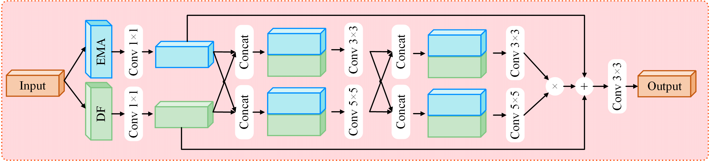

# SMDDFNet: State-space Modeling and Dynamic Dual Fusion Network for Traffic Sign Detection

  [](README.md)


<div align="center">
    
    
    
    
    
</div>

## Model Zoo

We've pre-trained YOLO-World-T/M from scratch and evaluate on the `TT100K val` , `GTSDB` and `VOC`. 

## Dataset

We use [TT100k](https://cg.cs.tsinghua.edu.cn/traffic-sign/) and convert it to YOLO format to evaluate the SOTA of models

### Inference on TT100K dataset


| model                                              | Params | FLOPs | ${AP}_{{50}}^{val}$ | ${AP}_{{95}}^{val}$ | ${AP}_{{S}}^{val}$ | ${AP}_{{M}}^{val}$ | ${AP}_{{L}}^{val}$ |
|:---------------------------------------------------|:-------|:-----:|:-------------------:|:-------------------:|:------------------:|:------------------:|:------------------:|
| [SMDDF-T](ultralytics/cfg/models/SMDDF/MDDF-T.yaml) | 6.1M   | 14.3G |        80.4         |        60.1         |        50.4        |        64.5        |        79.6        |
| [SMDDF-M](ultralytics/cfg/models/SMDDF/MDDF-B.yaml) | 21.8M  | 49.7G |        87.7         |        68.2         |        58.1        |        75.0        |        83.5        |


## Getting started

### 1. Installation

SMDDF is developed based on `torch==2.6.0`  and `CUDA Version==11.8`. 

#### 2.Clone Project 

```bash
git clone https://github.com/rainbowyuyu/SMDDFNet.git
```

#### 3. Install torch

```bash
pip install -r requirements.txt
```

#### 4. Install selective_scan
```bash
cd selective_scan && pip install . && cd ..
pip install -v -e .
```

#### 7. Training SMDDFNet
```bash
python SMDDF_train.py
```

## Acknowledgement

- This repo is modified from open source real-time object detection codebase [Ultralytics](https://github.com/ultralytics/ultralytics).
- The selective-scan from [VMamba](https://github.com/MzeroMiko/VMamba).
- The Mamba-backbone from [Mamba-Yolo](https://github.com/HZAI-ZJNU/Mamba-YOLO)


[//]: # (```bibtex)

[//]: # (@misc{,)

[//]: # (      title={}, )

[//]: # (      author={},)

[//]: # (      year={2024},)

[//]: # (      eprint={},)

[//]: # (      archivePrefix={arXiv},)

[//]: # (      primaryClass={cs.CV},)

[//]: # (      url={}, )

[//]: # (})

[//]: # (```)
